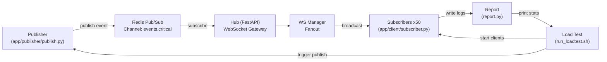

# Low-Latency Event Broadcaster  
### Detailed Project Explanation

---

## What is this project?

This project is a **real-time event broadcasting system** designed for microservices.

In many systems, when something important happens (like a server crash or service failure), many other services need to know **immediately**. Polling (checking every few seconds) is slow and wasteful. Instead, this system uses **push-based communication** so events are delivered instantly.

This system does the following:

1. A **Publisher** creates events when something happens.
2. Events go into **Redis Pub/Sub**, which acts as a live message bus.
3. A **Hub** listens to Redis and pushes events to many **Subscribers** using WebSockets.
4. Subscribers measure how long it took to receive each event.
5. A load test measures performance using 50 subscribers.

---

## Key Concepts

### Publisher  
The publisher is the component that creates events.  
It represents any system that detects something important, like:
- A server crash
- A service failure
- A health monitor

It does not know who will receive the event.  
It only says: “This happened.”

---

### Redis Pub/Sub  
Redis Pub/Sub is a real-time messaging system.

- Publisher sends messages to a **channel**
- Anyone subscribed to that channel receives the message instantly
- Messages are not stored, only delivered live

In this project:
- Channel name: `events.critical`
- Used for critical system events

---

### Hub  
The Hub is a FastAPI server that:

- Subscribes to Redis channel
- Accepts WebSocket clients
- Broadcasts each event to all connected clients
- Tracks statistics

It acts as the bridge between Redis and subscribers.

---

### Subscriber  
A subscriber is a simulated microservice.

It:
- Connects to the hub using WebSocket
- Receives events
- Calculates latency
- Writes results to log files

---

### Event  
An event is a message describing something that already happened.

Example:

```json
{
  "event_id": "uuid",
  "event_type": "SERVER_DOWN",
  "source": "server-a",
  "sequence": 1,
  "published_at_ms": 1768068834227
}
```

### High-Level Workflow
Publisher -> Redis Pub/Sub -> Hub -> WebSocket Subscribers -> Logs -> Report


## Tech stack

- Python
- FastAPI (WebSocket Hub + HTTP health/stats)
- Redis (Pub/Sub channel as internal event bus)
- websockets (Python subscriber clients)
- Docker Compose (local Redis + Hub)

## System architecture



### Folder Structure and File Roles

#### docker-compose.yml:
- Runs Redis and Hub containers.

#### app/hub/main.py:
- Creates FastAPI app, starts Redis listener, defines endpoints and WebSocket.

#### app/hub/redis_subscriber.py:
- Listens to Redis channel and forwards events.

#### app/hub/ws_manager.py:
- Manages WebSocket clients and broadcasts safely.

#### app/hub/stats.py:
- Tracks connected clients and events received.

#### app/publisher/publish.py:
- Generates events and publishes to Redis.

#### app/client/subscriber.py:
- Connects to hub, receives events, measures latency, writes logs.

#### scripts/run_clients.sh:
- Starts many subscribers.

#### scripts/stop_clients.sh:
- Stops subscribers.

#### scripts/run_loadtest.sh:
- Runs full benchmark pipeline.

#### app/loadtest/report.py:
- Aggregates logs and prints statistics.


## Core features
- Push-based fanout to many subscribers over WebSockets
- Redis Pub/Sub as internal event bus
- Single, shared event schema across publisher, hub, and subscribers
- End-to-end latency measurement per delivery
- Load test that spawns 50 subscribers and reports p50 / p95 / p99 / max latency and drop count

---

## Prerequisites
- Python 3.10+
- Docker and Docker Compose

---

## How to Run

### Start infra:
```bash
docker compose up --build
```
### Create venv:
```bash
python3 -m venv .venv
source .venv/bin/activate
pip install -r requirements.txt
```

### Start subscribers:
```bash
scripts/run_clients.sh 50
```

### Publish events:
```bash
REDIS_HOST=localhost python -m app.publisher.publish --type SERVER_DOWN --source server-a --count 10
```

### Run full test:
```bash
scripts/run_loadtest.sh
```

## Understanding Output

### Example:

- Clients: 50
- Events: 50
- Expected deliveries: 2500
- Received deliveries: 2500
- Dropped deliveries: 0

### Latency (ms):
- p50: 66
- p95: 91
- p99: 93
- max: 93

### Meaning:
- All messages delivered, no drops.
- Most messages under ~70ms.
- Worst under ~100ms.

## One-Sentence Summary

This project builds a low-latency event broadcasting system where publishers send events to Redis Pub/Sub, a FastAPI hub subscribes and fans them out over WebSockets to many subscribers, and a load test measures end-to-end latency using p50/p95/p99 percentiles.
